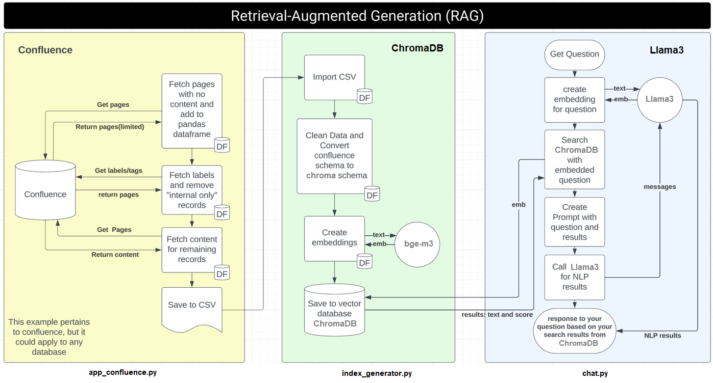
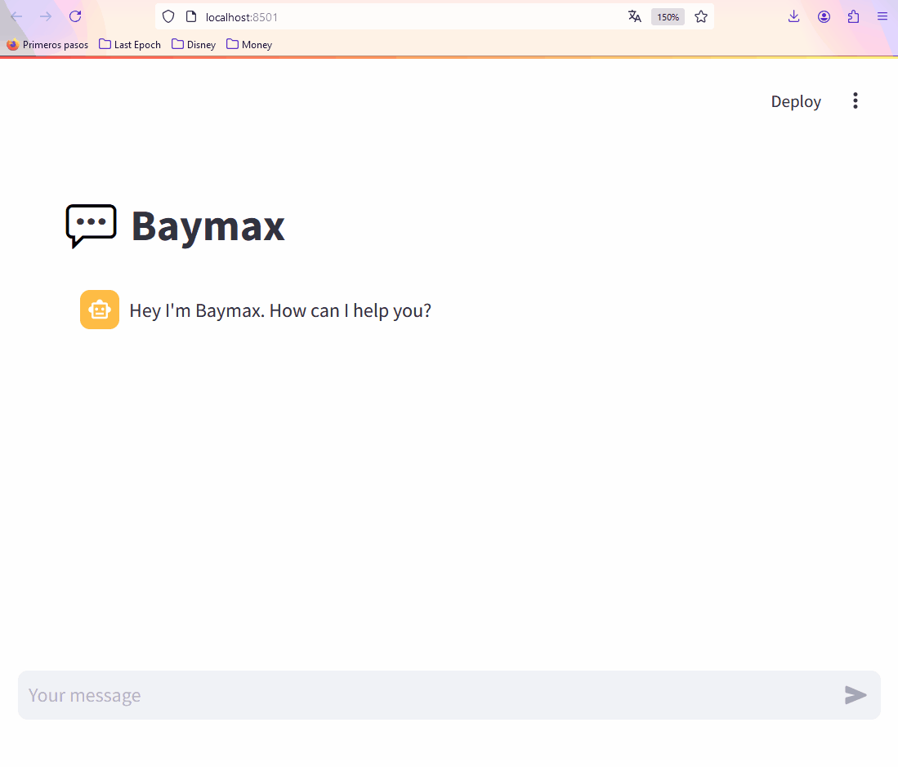

# Baymax - RAG System

This RAG system fetches information from your private Confluence as a CSV file, vectorizes and stores the embeddings in ChromaDB, and then uses it via Streamlit or as a Slack bot, interpreting the result with Llama 3.

## Project Structure

RAG Flow Chart: Please refer to the rag_flowchart.png in the repository for a visual representation of the system workflow. 



## Requirements

- Python 3.8+
- Python packages listed in `requirements.txt`
- `.env` file with the following variables:
  - `CONFLUENCE_DOMAIN`
  - `CONFLUENCE_TOKEN`
  - `CONFLUENCE_SPACE_KEY`
  - `CONFLUENCE_TEAM_KEY`
  - `SLACK_BOT_TOKEN`
  - `SLACK_APP_TOKEN`
  - `SLACK_SIGNING_SECRET`
  - `GROQ_API_KEY` (optional, for using Groq)
- If you are using a fully local installation, install Llama3 (it should require a good GPU in your system)

## Demo



## Setup

Clone the repository.

```sh
git clone git@github.com:ikarius6/baymax-rag-system.git
```

Create your local enviroment
```sh
python -m venv venv
source venv/bin/activate
```

Install the necessary packages:
```sh
pip install -r requirements.txt
```

Create a `.env` file in the root directory with the required environment variables.

```yml
# Confluence
CONFLUENCE_DOMAIN="https://yourconfluence.com"
CONFLUENCE_TOKEN=""
CONFLUENCE_SPACE_KEY="SPACE_KEY"
CONFLUENCE_TEAM_KEY="TEAM"

# Groq
GROQ_API_KEY=""

# Slack
SLACK_BOT_TOKEN=''
SLACK_APP_TOKEN=''
SLACK_SIGNING_SECRET=''
```

## Llama3 with Ollama

Install Ollama in your system
(https://github.com/ollama/ollama)

```sh
curl -fsSL https://ollama.com/install.sh | sh
```

Download llama3 and start the ollama server
```sh
ollama pull llama3
ollama serve
```

## Llama3 with Groq

To use a remote version of Llama3, enable the Grop API by getting your own `GROQ_API_KEY`
- Go to [https://console.groq.com/keys](https://console.groq.com/keys)
- Generate a new token
- Ad it to `GROQ_API_KEY` in your `.env` 

## Confluence Token

To get your own `CONFLUENCE_TOKEN`

- Go to https://yourconfluence.com/plugins/personalaccesstokens/usertokens.action
- Generate a new token
- Add it to `CONFLUENCE_TOKEN` in your `.env`

## Slack Setup

Import the `slack_manifest.yml` to your Slack App, then get your access tokens for your `.env` file.

For `SLACK_SIGNING_SECRET` go to Basic Information > App Credentials > Signing Secret
For `SLACK_APP_TOKEN` go to Basic Information > App-Level Tokens > Generate Token
For `SLACK_BOT_TOKEN` go to OAuth & Permissions > OAuth Tokens > Bot User OAuth Token

## Usage

### Fetch Data from Confluence

Make sure you have the `cookie.txt` file with the session to avoid SSO issues. The cookie can be extracted for any request in the [confluence](https:/yourconfluence.com) page.

Run `app_confluence.py` to fetch data from Confluence and save it as a CSV file, the process could take a few minutes:

```sh
python app_confluence.py
```

This process going to create data/kb.csv file with all the necessary data for the next step.

### Generate Embeddings

Run `index_generator.py` to generate embeddings and save them in ChromaDB, this process need to download an embedding model from HuggingFace so the process could take several minutes:

```sh
python index_generator.py
```

Once your vector database is populated you can use your chatbot with Streamlit or as a Slack app.

### Use in Streamlit

Run `streamlit.py` to start the Streamlit application:

```sh
streamlit run streamlit.py
```

### Use in Slack

- Set up your application in Slack and get the necessary tokens by using the Slack Setup section.

Run `slack.py` to start the Slack bot:

```sh
python slack.py
```

## Project Files

### `app_confluence.py`
Code to fetch data from Confluence and save it as a CSV file.

### `index_generator.py`
Code to generate embeddings and save them in ChromaDB.

### `chat.py`
Code for the query logic using the stored embeddings.

### `streamlit.py`
Code for the Streamlit user interface.

### `slack.py`
Code for the Slack integration.

### `utils.py`
Helper methods to simplify the operation
