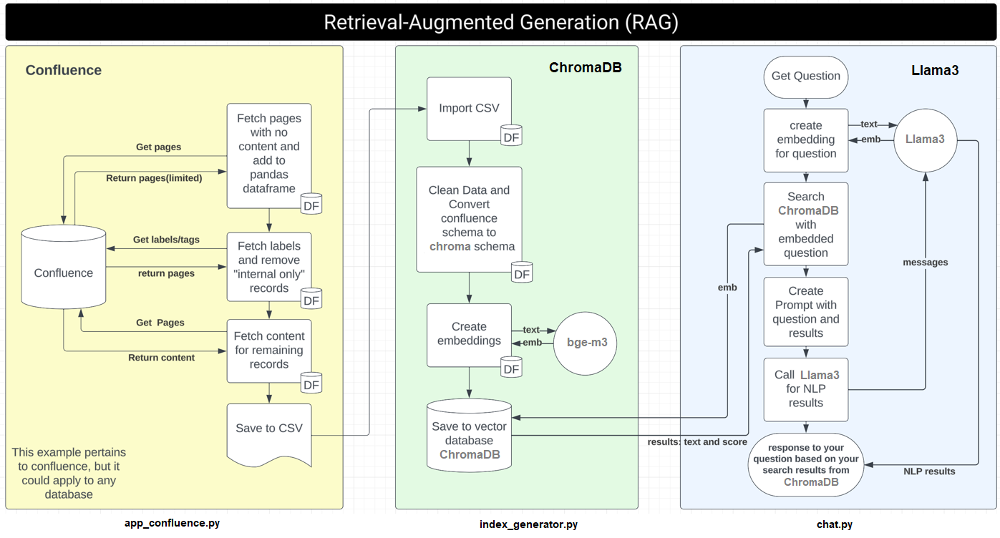

# Baymax - RAG System

This RAG system fetches information from your private Confluence as a CSV file, vectorizes and stores the embeddings in ChromaDB, and then uses it via Streamlit or as a Slack bot, interpreting the result with Llama 3.

**GraphRAG mode** adds a Neo4j knowledge graph for richer, relationship-aware retrieval — surfacing related pages, shared entities, and topic communities that flat vector search would miss.

## Architecture

### Standard RAG Pipeline
```
Confluence API → app_confluence.py → CSV → index_generator.py → ChromaDB → chat.py → LLM → Streamlit/Slack
```

### GraphRAG Pipeline (enhanced)
```
Confluence API → app_confluence.py → CSV + hierarchy + links
                                      ├── index_generator.py → ChromaDB ──┐
                                      └── graph_builder.py → Neo4j ───────┤
                                                                          ├── GraphRetriever → LLM → Streamlit/Slack
```



## Requirements

- Python 3.8+
- Python packages listed in `requirements.txt`
- `.env` file (see `.env.example`)
- Docker (for Neo4j, if using GraphRAG)
- If you are using a fully local installation, install Llama3 (it should require a good GPU in your system)

## Demo


## Setup

Clone the repository.

```sh
git clone git@github.com:ikarius6/baymax-rag-system.git
```

Create your local enviroment
```sh
python -m venv venv
source venv/bin/activate
```

Install PyTorch with CUDA support (required for GPU acceleration, especially RTX 50-series Blackwell GPUs):
```sh
pip install --pre torch torchvision torchaudio --index-url https://download.pytorch.org/whl/nightly/cu128
```

Install the remaining packages:
```sh
pip install -r requirements.txt
```

Create a `.env` file in the root directory with the required environment variables (see `.env.example`).

## Neo4j Setup (GraphRAG)

Start Neo4j with Docker:
```sh
docker compose up -d
```

This starts Neo4j Community 5 with the Graph Data Science plugin. Access the browser at [http://localhost:7474](http://localhost:7474).

Default credentials: `neo4j` / `changeme` (change `NEO4J_PASSWORD` in your `.env`).

## Llama3 with Ollama

Install Ollama in your system
(https://github.com/ollama/ollama)

```sh
curl -fsSL https://ollama.com/install.sh | sh
```

Download llama4 and start the ollama server
```sh
ollama pull llama4
ollama serve
```

## Llama4 with Groq

To use a remote version of Llama4, enable the Grop API by getting your own `GROQ_API_KEY`
- Go to [https://console.groq.com/keys](https://console.groq.com/keys)
- Generate a new token
- Ad it to `GROQ_API_KEY` in your `.env` 

## Confluence Token

To get your own `CONFLUENCE_TOKEN`

- Go to https://yourconfluence.com/plugins/personalaccesstokens/usertokens.action
- Generate a new token
- Add it to `CONFLUENCE_TOKEN` in your `.env`

## Slack Setup

Import the `slack_manifest.yml` to your Slack App, then get your access tokens for your `.env` file.

For `SLACK_SIGNING_SECRET` go to Basic Information > App Credentials > Signing Secret
For `SLACK_APP_TOKEN` go to Basic Information > App-Level Tokens > Generate Token
For `SLACK_BOT_TOKEN` go to OAuth & Permissions > OAuth Tokens > Bot User OAuth Token

## Usage

### 1. Fetch Data from Confluence

Make sure you have the `cookie.txt` file with the session to avoid SSO issues. The cookie can be extracted for any request in the [confluence](https:/yourconfluence.com) page.

```sh
python app_confluence.py
```

This creates `data/kb.csv`, `data/page_hierarchy.csv`, and `data/page_links.csv`.

**Subsequent runs are incremental** — only new/modified pages are fetched:
```sh
python app_confluence.py          # Incremental (default)
python app_confluence.py --full   # Force full re-download
```

### 2. Generate Embeddings

Uses `BAAI/bge-m3` (configurable via `EMBED_MODEL` in `.env`):

```sh
python index_generator.py          # Only embeds new documents
python index_generator.py --full   # Re-embed everything
```

### 3. Build Knowledge Graph (GraphRAG)

Extracts entities using Llama 4 Scout and builds the graph in Neo4j:

```sh
python graph_builder.py            # Incremental (skips already-processed pages)
python graph_builder.py --full     # Wipe graph and rebuild from scratch
```

Open the Neo4j Browser to explore:
```cypher
MATCH (p:Page)-[r]->(q) RETURN p, r, q LIMIT 50
```

### 4. Sharing Pre-Built Databases

You can share your databases so other users skip steps 1-3 entirely:

- **ChromaDB**: Copy the `./chroma_db/` folder
- **Neo4j**: Export the Docker volume or use `apoc.export`
- **CSV Data**: Copy the `./data/` folder

The recipient only needs to:
```sh
docker compose up -d
streamlit run streamlit.py -- --use-graph
```

### 5. Use the Chatbot

#### Streamlit (standard mode)
```sh
streamlit run streamlit.py
```

#### Streamlit (GraphRAG mode)
```sh
USE_GRAPH=true streamlit run streamlit.py
```

Or pass the flag:
```sh
streamlit run streamlit.py -- --use-graph
```

#### Slack
```sh
python slack.py
```

## Project Files

### `app_confluence.py`
Fetches pages from Confluence, extracts content, page hierarchy, and cross-page links.

### `index_generator.py`
Generates embeddings using FlagEmbedding (`bge-multilingual-gemma2`) with batch processing and upserts to ChromaDB.

### `graph_builder.py`
Builds a Neo4j knowledge graph: page nodes, hierarchy/link relationships, entity extraction via Llama 4 Scout, and community detection.

### `graph_retriever.py`
Hybrid retriever combining vector search + graph expansion + community context + optional BGE reranking.

### `chat.py`
Query logic with `--use-graph` toggle for switching between standard and GraphRAG retrieval.

### `streamlit.py`
Streamlit user interface.

### `slack.py`
Slack integration.

### `utils.py`
Helper methods for ChromaDB, embeddings, and response processing.

### `docker-compose.yml`
Docker Compose configuration for Neo4j.
