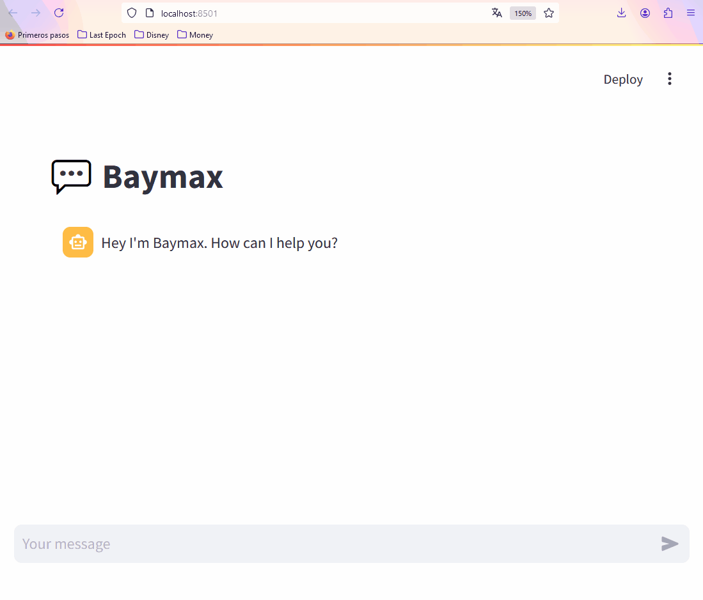

# Baymax - GraphRAG System

This RAG system fetches information from your private Confluence as a CSV file, vectorizes and stores the embeddings in ChromaDB, and then uses it via Streamlit or as a Slack bot, interpreting the result with Llama 4 Scout or Qwen3.

**GraphRAG mode** adds a Neo4j knowledge graph for richer, relationship-aware retrieval — surfacing related pages, shared entities, and topic communities that flat vector search would miss.

## Architecture

### GraphRAG Pipeline
```
flowchart LR
    classDef confluence fill:#fdfd96,stroke:#333,stroke-width:2px;
    classDef chroma fill:#e8f4f8,stroke:#333,stroke-width:2px;
    classDef neo4j fill:#f0d9ff,stroke:#333,stroke-width:2px;
    classDef chat fill:#e6f7e6,stroke:#333,stroke-width:2px;

    subgraph Phase1 ["① Extraction — app_confluence.py"]
        direction TB
        A1[(Confluence)] --> A2[Fetch Pages & Content]
        A2 --> A3[Filter 'internal_only' labels]
        A3 --> A4[Extract Links & Hierarchy]
        A4 --> A5[(kb.csv)]
        A4 --> A6[(page_hierarchy.csv)]
        A4 --> A7[(page_links.csv)]
    end
    class Phase1 confluence;

    subgraph Phase2 ["② Vector Indexing — index_generator.py"]
        direction TB
        B1[Clean & Convert Schema] --> B2[Embed with bge-m3]
        B2 --> B3[(ChromaDB)]
    end
    class Phase2 chroma;

    subgraph Phase3 ["③ Graph Building — graph_builder.py"]
        direction TB
        C1[Page Nodes] --> C2[CHILD_OF edges]
        C2 --> C3[LINKS_TO edges]
        C3 --> C4[Llama4\nEntities & Relations]
        C4 --> C5[Community Detection]
        C5 --> C6[(Neo4j)]
    end
    class Phase3 neo4j;

    subgraph Phase4 ["④ Hybrid Retrieval & Chat — chat.py / graph_retriever.py"]
        direction TB
        D1([User Question]) --> D2[Embed Question]
        D2 --> D3[1· Vector Search\nChromaDB top-K]
        D3 --> D4[2· Graph Expansion\nNeo4j 1-hop + Communities]
        D4 --> D5[3· Merge Docs]
        D5 --> D6{Reranker?}
        D6 -- Yes --> D7[BGE Cross-Encoder]
        D6 -- No  --> D8[Top-N Context]
        D7 --> D8
        D8 --> D9[Build Prompt]
        D9 --> D10((Llama4))
        D10 --> D11([Response])
    end
    class Phase4 chat;

    %% Inter-phase edges
    A5 --> Phase2
    A5 -.-> C1
    A6 -.-> C2
    A7 -.-> C3
    B3 -.-> D3
    C6 -.-> D4
```



## Requirements

- Python 3.8+
- Python packages listed in `requirements.txt`
- `.env` file (see `.env.example`)
- Docker (for Neo4j, if using GraphRAG)
- If you are using a fully local installation, install qwen3:14b (it should require a good GPU in your system)

## Demo



## Running with Docker (Recommended for most users)

Docker bundles the Streamlit chat interface, all Python dependencies, and Neo4j into a single command — no Python installation required.

### Prerequisites

- [Docker Desktop](https://www.docker.com/products/docker-desktop/) installed and running.
- A **Groq API key** (optional): [console.groq.com/keys](https://console.groq.com/keys)

### Step 1 — Configure your environment

Copy the example env file and fill in your credentials:

```sh
cp .env.example .env
```

Open `.env` and set at minimum:

```env
GROQ_API_KEY="gsk_..."           # optional — your free Groq key
NEO4J_PASSWORD="changeme"        # optional — change if you want a custom password
```

> **Note:** You do **not** need to change `NEO4J_URI` — Docker sets it automatically to reach the database container.

### Step 2 — Start everything

```sh
docker compose up --build
```

The first run will download images and install Python packages (~5 minutes). Subsequent starts are fast.

You'll see the app is ready when you see:

```
baymax-streamlit  |   You can now view your Streamlit app in your browser.
baymax-streamlit  |   URL: http://0.0.0.0:8501
```

### Step 3 — Open the chat

**[http://localhost:8501](http://localhost:8501)** — Baymax chat interface

**[http://localhost:7474](http://localhost:7474)** — Neo4j Browser (optional, for graph exploration)

### Stopping and restarting

```sh
# Stop all services (data is preserved in volumes)
docker compose down

# Start again without rebuilding (also re-reads .env)
docker compose up -d

# Rebuild the image (e.g. after updating source code or requirements.txt)
docker compose up --build -d
```

> **Changed something in `.env`?** Use `docker compose up -d` — it recreates the container and re-reads the `.env` file.
> `docker compose restart` does **not** re-read `.env`; it reuses the environment frozen at container creation.

### Data persistence

Your embeddings, source data, and backups are **mounted from your local filesystem** into the container:

| Local folder | What it stores |
|---|---|
| `./chroma_db/` | Vector embeddings (ChromaDB) |
| `./data/` | Fetched CSV files from Confluence / GitHub |
| `./backups/` | Export/import zip archives |

Deleting the container does **not** delete these folders. Use the **Data Manager** in the Streamlit sidebar to export and import a full backup zip (including Neo4j graph data).

### Restoring a backup inside Docker

If you have a pre-built backup zip to share with a teammate:

1. Place the `.zip` file inside the `backups/` folder.
2. Open [http://localhost:8501](http://localhost:8501) and use the **Data Manager** sidebar → _"Existing backups"_ → select and restore.
3. The page will prompt you to restart — run `docker compose restart streamlit`.

### Notes

- **CPU-only mode (default)**: The Docker image uses CPU-only PyTorch for broad compatibility. Inference is slightly slower than GPU, but fully functional for most teams.
- **Ollama / local LLM**: If you want to use a local Ollama model instead of Groq, Ollama must run on your host machine. Set `OLLAMA_BASE_URL=http://host.docker.internal:11434` in your `.env` and leave `GROQ_API_KEY` empty.

### GPU / CUDA build (for users with an NVIDIA GPU)

If you have an NVIDIA GPU and want faster embedding inference, use the CUDA override:

**Host prerequisites** (one-time setup):
1. NVIDIA drivers installed
2. [nvidia-container-toolkit](https://docs.nvidia.com/datacenter/cloud-native/container-toolkit/install-guide.html) installed and Docker restarted

**Build and run with GPU support:**
```sh
docker compose -f docker-compose.yml -f docker-compose.cuda.yml up --build
```

This installs the CUDA 12.8 PyTorch build and passes your GPU into the container. `chat.py` automatically detects CUDA via `torch.cuda.is_available()` — no code changes needed.

## Setup (Advanced - Local Installation)

Clone the repository.

```sh
git clone git@github.com:ikarius6/baymax-rag-system.git
```

Create your local enviroment
```sh
python -m venv venv
source venv/bin/activate
```

Install PyTorch with CUDA support (required for GPU acceleration, especially RTX 50-series Blackwell GPUs):
```sh
pip install --pre torch torchvision torchaudio --index-url https://download.pytorch.org/whl/nightly/cu128
```

Install the remaining packages:
```sh
pip install -r requirements.txt
```

Create a `.env` file in the root directory with the required environment variables (see `.env.example`).

## Neo4j Setup (GraphRAG)

Start Neo4j with Docker:
```sh
docker compose up -d
```

This starts Neo4j Community 5 with the Graph Data Science plugin. Access the browser at [http://localhost:7474](http://localhost:7474).

Default credentials: `neo4j` / `changeme` (change `NEO4J_PASSWORD` in your `.env`).

## qwen3:14b with Ollama

Install Ollama in your system
(https://github.com/ollama/ollama)

```sh
curl -fsSL https://ollama.com/install.sh | sh
```

Download qwen3:14b and start the ollama server
```sh
ollama pull qwen3:14b
ollama serve
```

Note: qwen3:14b is better than llama4 for local because llama4 is massive and requires a lot of VRAM

## Llama4 with Groq

To use a remote version of Llama4, enable the Grop API by getting your own `GROQ_API_KEY`
- Go to [https://console.groq.com/keys](https://console.groq.com/keys)
- Generate a new token
- Ad it to `GROQ_API_KEY` in your `.env` 

## Copilot Setup

To use Copilot instead, enable it in your `.env` file by setting the following variables:
- `COPILOT_API_KEY` - Your GitHub Copilot API key
- `COPILOT_BASE_URL` - The base URL for the Copilot API (default: https://api.githubcopilot.com)
- `COPILOT_MODEL` - The model to use (default: gpt-4o)

## Confluence Token

To get your own `CONFLUENCE_TOKEN`

- Go to https://yourconfluence.com/plugins/personalaccesstokens/usertokens.action
- Generate a new token
- Add it to `CONFLUENCE_TOKEN` in your `.env`

## Github Token

To get your own GITHUB_TOKEN

- Go to https://github.twdcgrid.net/settings/tokens/new
- Generate a new token with 'public_repo' scope
- Add it to GITHUB_TOKEN in your .env

## Slack Setup

Import the `slack_manifest.yml` to your Slack App, then get your access tokens for your `.env` file.

For `SLACK_SIGNING_SECRET` go to Basic Information > App Credentials > Signing Secret
For `SLACK_APP_TOKEN` go to Basic Information > App-Level Tokens > Generate Token
For `SLACK_BOT_TOKEN` go to OAuth & Permissions > OAuth Tokens > Bot User OAuth Token

## Usage

### 1. Fetch Data from Confluence

Make sure you have the `cookie.txt` file with the session to avoid SSO issues. The cookie can be extracted for any request in the [confluence](https:/yourconfluence.com) page.

```sh
python app_confluence.py
```

This creates `data/kb.csv`, `data/page_hierarchy.csv`, and `data/page_links.csv`.

### 1.2 Fetch Data from Github (optional)
Require: [Github Token](#github-token)

Run `app_github.py` to fetch readme data from Github and save it as a CSV file, you can change the `GITHUB_ORG_NAME` from [CLU](https://github.twdcgrid.net/CLU) to another one in the `.env` file, the process could take a few minutes:

```sh
python app_github.py
```

This process going to create data/github.csv file with all the necessary data for the next step.

**Subsequent runs are incremental** — only new/modified pages are fetched:
```sh
python app_confluence.py          # Incremental (default)
python app_confluence.py --full   # Force full re-download

python app_github.py          # Incremental (default)
python app_github.py --full   # Force full re-download
```

### 2. Generate Embeddings

Uses `BAAI/bge-m3` (configurable via `EMBED_MODEL` in `.env`):

```sh
python index_generator.py          # Only embeds new documents
python index_generator.py --full   # Re-embed everything
```

### 3. Build Knowledge Graph (GraphRAG)

Extracts entities using Llama 4 Scout and builds the graph in Neo4j:

```sh
python graph_builder.py            # Incremental (skips already-processed pages)
python graph_builder.py --full     # Wipe graph and rebuild from scratch
```

Open the Neo4j Browser to explore:
```cypher
MATCH (p:Page)-[r]->(q) RETURN p, r, q LIMIT 50
```

### 4. Sharing Pre-Built Databases

Use `data_manager.py` to export/import all collected data (`data/`, `chroma_db/`, and Neo4j graph) as a single zip file. This lets other users skip the heavy scraping, embedding, and graph-building steps entirely.

#### Export
```sh
python data_manager.py export              # -> backups/baymax_backup_<timestamp>.zip
python data_manager.py export my_backup    # -> backups/my_backup.zip
```

#### Import
```sh
python data_manager.py import backups/my_backup.zip
```

#### List available backups
```sh
python data_manager.py list
```

You can also export and import directly from the **Streamlit sidebar** (Data Manager section).

The recipient only needs to:
```sh
docker compose up -d
python data_manager.py import backups/<backup_name>.zip
streamlit run streamlit.py -- --use-graph
```

### 5. Use the Chatbot

#### Streamlit (standard mode)
```sh
streamlit run streamlit.py
```

#### Streamlit (GraphRAG mode)
```sh
USE_GRAPH=true streamlit run streamlit.py
```

Or pass the flag:
```sh
streamlit run streamlit.py -- --use-graph
```

#### Slack
```sh
python slack.py
```

## VS Code Extension

Baymax also ships as a **VS Code extension** that brings the RAG chat directly into your editor — no browser tab required. Ask questions about your Confluence knowledge base, get source references, and check API health without leaving your IDE.

Key highlights:

- **Activity Bar panel** — open the chat from the sidebar like any built-in VS Code view.
- **Inline source references** — every answer links back to the original Confluence pages.
- **Health indicator** — a live status dot shows whether the Baymax API is reachable.
- **Configurable** — point it at any Baymax API instance via the `baymax.apiUrl` setting.

### Quick start

1. Start the Baymax API server:
   ```sh
   .\venv\Scripts\uvicorn api:app --host 127.0.0.1 --port 8888 --reload
   ```
2. Open the `vscode-extension/` folder in VS Code, compile, and press **F5**
2.5. (Optional) Or install the extension from the `.vsix` file if you want to test it outside the development environment.

> For full setup instructions, configuration options, and packaging details see the **[VS Code Extension README](./vscode-extension/README.md)**.

## Project Files

### `app_confluence.py`
Fetches pages from Confluence, extracts content, page hierarchy, and cross-page links.

### `app_github.py`
Fetches readme files from Github, extracts README content.

### `index_generator.py`
Generates embeddings using FlagEmbedding (`bge-multilingual-gemma2`) with batch processing and upserts to ChromaDB.

### `graph_builder.py`
Builds a Neo4j knowledge graph: page nodes, hierarchy/link relationships, entity extraction via Llama 4 Scout, and community detection.

### `graph_retriever.py`
Hybrid retriever combining vector search + graph expansion + community context + optional BGE reranking.

### `chat.py`
Query logic with `--use-graph` toggle for switching between standard and GraphRAG retrieval.

### `data_manager.py`
Export/import all collected data (`data/`, `chroma_db/`, Neo4j graph) as a single zip file. CLI and Streamlit sidebar support.

### `streamlit.py`
Streamlit user interface with Data Manager sidebar for export/import.

### `slack.py`
Slack integration.

### `utils.py`
Helper methods for ChromaDB, embeddings, and response processing.

### `docker-compose.yml`
Docker Compose configuration for Neo4j and the Streamlit app. Run with `docker compose up --build`.
